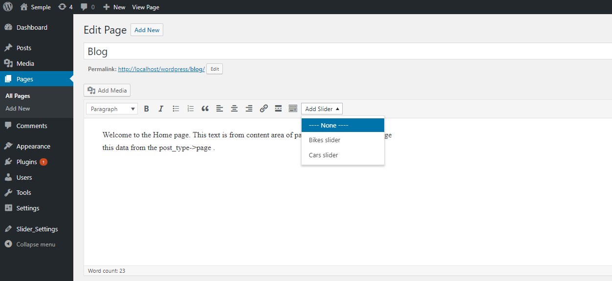
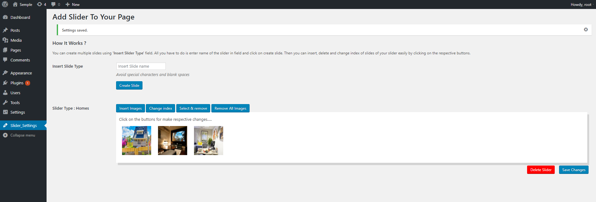

# WordPress Plugin Challenge

This Assignment is on rtcamp’s challenge-2 : WordPress Plugin development. As given on the link there are two assignments I choose the WordPress Slideshow Plugin Assignment.

## Getting Started

This plugin is for create slider in your pages and posts. Along with this document you will get the copy of the project. Copy this file to your WordPress Plugin folder and install it. The brief description is given below.

### Requirements

To use this Plugin no aditional software or plugins are needed we just need a latest version of WordPress in working condition.

## What it will do ?

Activation of the Plugin will create a custom admin menu **Slider_Settings** here you can create multiple Sliders. It will add a custom button to the visual editor of post type 'Pages' & 'Posts'.   

### How It Works ?

To customize Slider go to WordPress **Dashboard -> Menubar -> Slider_Settings**. 

From here You can create multiple slides using **Insert Slider Type** field. All you have to do is enter name of the slider in field and click on create slide. 
Now, you can insert, delete and change index of slides of your slider easily by clicking on the respective buttons. To add Slider in 'Post' or 'Page' open the edit page of your respective post and click on the button **Add slider**. By clicking on it a pop-up menu will appear that contains list of sliders you have created. You can select any slider which you want to attach to the post.  



**Slider_Settings** page contains following buttons to do respective changes :

**Insert Images** - Insert images to your Slider
**Change Index** - Change index of images in Slider
**Select & Remove** - Select and Remove remove images from Slider 
**Remove All Images** - Remove All the Images From the Slider 
**Save Changes** - To Save new Changes
**Delete** - To Delete the respective Slider



### Shortcode

A Shortcode named **'name_of_slider'** will be generated. You can use it in pages and posts using syntax :
```
[name_of_slider]
```
ex. if you have slider name 'Bikes' then shortcode of that slider will be [Bikes].

**Note** - On plugin Deactivation All the Sliders and Images in the sliders will be lost. you can again create Sliders and insert Images.

## Frameworks used

* JS framework : jQuery
* Testing framework : PHPUnit

## Tests

For testing PHPUnit testing framework is used. All the tests are rest in test directory.

## Author

* **Viral Solanki** 

## Acknowledgments

* [WordPress.org](https://wordpress.org)
* [WordPress Codex](https://codex.wordpress.org)
* [WordPress StackExchange](https://codex.wordpress.stackexchange.com)
* etc

## Version

* 2.0 : Multiple sliders & Button to Visual Editor

## Demo Link

*[http://myplugin.gq/](http://myplugin.gq/) 
